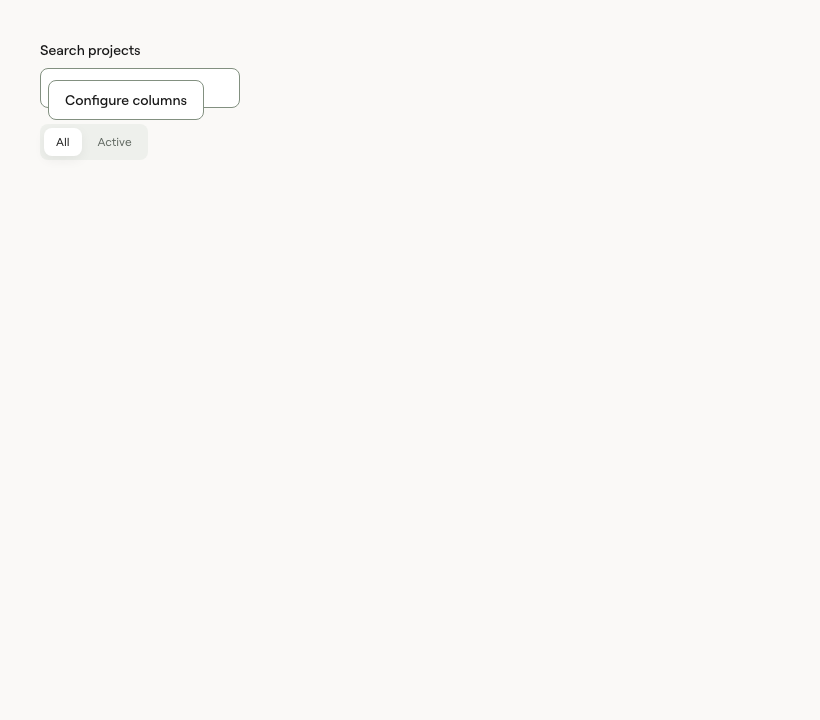
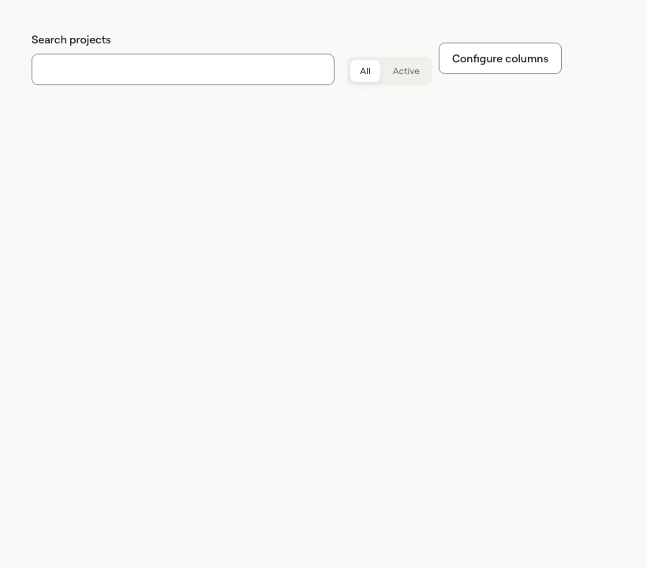
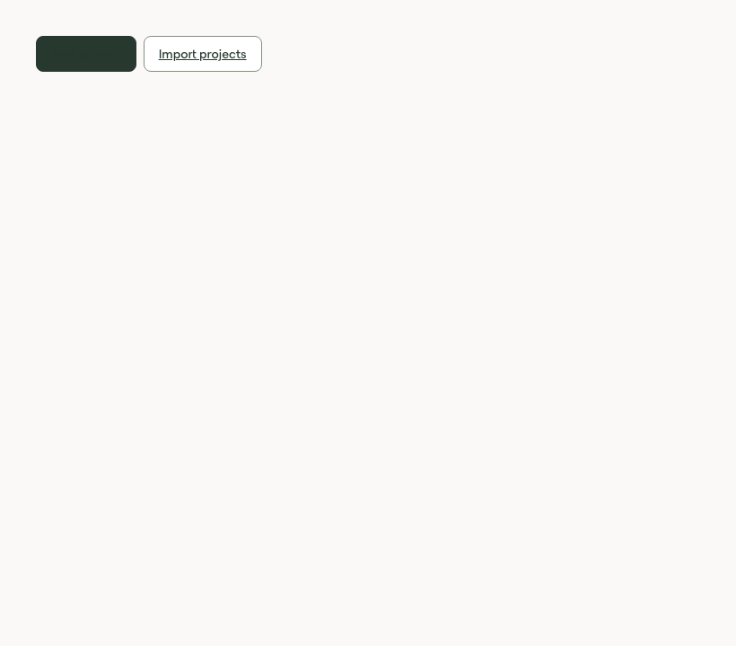
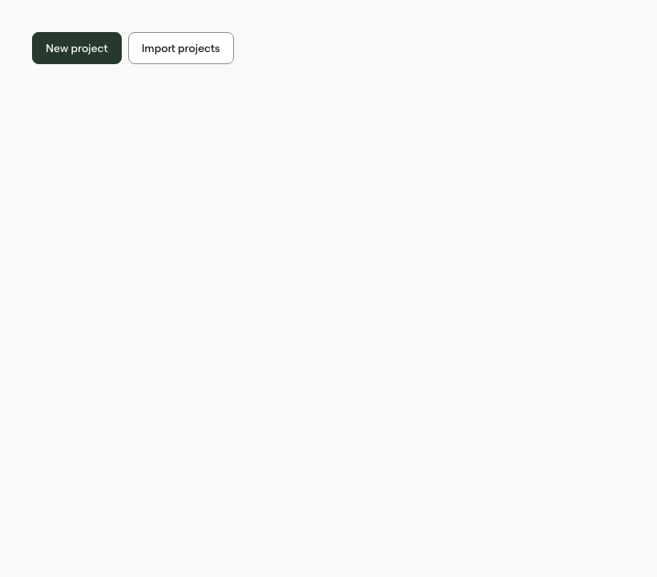
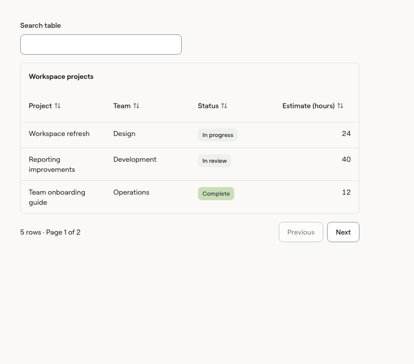

# Adoption layout and action fixes

A live 0.10.0 consumer exposed three shared-library integration defects. Inspection used computed layout and matched stylesheet rules; no consumer data or source was copied into this repository.

## Findings

- `FilterToolbar` had inline-size containment but no flex basis. Beside sibling page actions it collapsed to 0px, which correctly triggered its narrow-container rule and stacked every filter on a wide page. Giving the existing toolbar a flexible measurable width restores the intended horizontal, wrapping filter row. A new component is unnecessary.
- A navigation anchor using the public `cui-button cui-button-primary` classes inherited `.cui-root a` after the primary button rule. Its foreground and background both resolved to the accent colour. Generic link colour and underline rules now exclude button-styled anchors.
- `cui-table-sort` rendered its label and icon as unspaced inline content. It now uses inline flex alignment and the approved 4px spacing token.

## Neutral visual evidence

| Area                               | Before                                                                                       | After                                                                                                              |
| ---------------------------------- | -------------------------------------------------------------------------------------------- | ------------------------------------------------------------------------------------------------------------------ |
| Filter toolbar beside actions      |  |                            |
| Navigation links styled as buttons |   |  |
| Sort label and icon                |           |                          |

## Compatibility

No exports, props, tokens, class names or default component choices change. Existing standalone toolbars retain their layout; toolbars in flex rows can now use available width. Ordinary links retain the same accent colour and underline. Button-styled anchors now match native Button variants. Sort controls retain their semantics, keyboard behaviour and 40px target height.

## Validation

Passed locally: types, lint, formatting, token generation, public API and CSS contracts, catalogue/release metadata, registry drift, 292 light-theme tests, 233 dark-theme stories, coverage, static Storybook, the packed Vite consumer, Next.js 16/pnpm, Next.js 15/npm/Tailwind 4 and Tailwind 3 CSS compatibility. The package check verified 321 files.

Focused browser stories reproduce the three integrations without consumer data. They assert a toolbar wider than 480px beside a sibling action, horizontal and bottom-aligned controls, theme-correct button-link colours without underlining, and a 4px centred sort-label gap. The first full run also reproduced a pre-existing timing weakness in an InlineEdit test; its DOM assertion could finish before the focus-restoration effect. The test now waits for the documented focus result, and the unchanged production component passed in the full rerun and coverage run.
