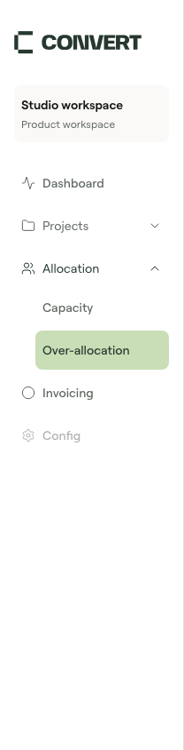
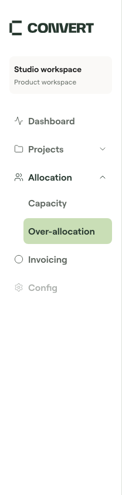
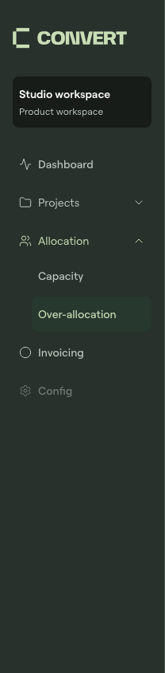
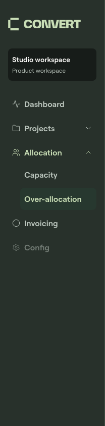

# Sidebar navigation density review

Issue [#37](https://github.com/tomrosscd/cd-product-ui/issues/37) describes an adoption gap: a consumer could only accept smaller, lighter navigation or override the shared component's CSS. A supported optional variant is appropriate for the library.

## Decision and compatibility

Add `density="compact" | "comfortable"` to `DashboardSidebar`, also available through `DashboardShell`. Compact remains the default and keeps the existing stylesheet behaviour. Comfortable uses existing 16px body and 600 semibold tokens. The proposal's 15px example is not added to the shared scale; the existing 16px role provides the readability improvement within the approved system.

Nested section headings grow from 12px to 14px to retain hierarchy beneath primary navigation. Destination and section labels gain weight consistently. Line height, padding, icon size, rail width and single-line row heights stay unchanged. Long labels can wrap and grow. The variant belongs to the navigation element inside the shared desktop/mobile content, so the portalled drawer receives it without relying on inherited wrapper CSS.

Only an optional prop and a CSS class are added to the public contracts. No existing exports, tokens, CSS classes or defaults are removed or renamed. Routing, collapsed-state ownership and consumer files are unchanged. Version 0.10.0 and its release tag remain unchanged; applications need a future release before adopting this prop.

## Visual evidence

Screenshots use synthetic Storybook navigation. Font rendering is from the existing local preview; no font binaries are included.

| Compact default                                                 | Comfortable                                                             |
| --------------------------------------------------------------- | ----------------------------------------------------------------------- |
|  |  |
|    |    |

Additional captures cover [mobile light](fixtures/2026-09-14-sidebar/mobile-light.png), [mobile dark](fixtures/2026-09-14-sidebar/mobile-dark.png), [long labels light](fixtures/2026-09-14-sidebar/long-labels-light.png) and [long labels dark](fixtures/2026-09-14-sidebar/long-labels-dark.png).

## Validation

Passed locally: `pnpm check` (60 unit tests and 237 browser stories, types, lint, token/CSS contracts and static Storybook), `pnpm api:check`, `pnpm registry:check`, `pnpm test:dark` (237 stories), `pnpm test:coverage`, `pnpm package:check`, `pnpm next:check`, `pnpm compatibility:check`, `pnpm docs:check`, `pnpm release:check` and `pnpm format:check`. Coverage remains above the existing thresholds.

Additional browser checks covered 1440px desktop and 390px mobile in light/dark themes, long-label wrapping without horizontal overflow, keyboard focus containment, Escape/focus return, drawer dismissal after choosing a route and expanding a collapsed rail by choosing a section. Installed-archive rendering verified both DashboardSidebar and DashboardShell with the distributed CSS: default/compact labels are 14px/500, comfortable labels are 16px/600 and single-line desktop rows remain 44px.

The first full run failed an existing inline-edit focus assertion in `tests/adoption-controls.test.tsx:83`; an unchanged full rerun and the subsequent coverage run passed. No inline-edit code or test was changed. GitHub CI and another developer's review remain required before merge. No release or consumer upgrade has been performed.
