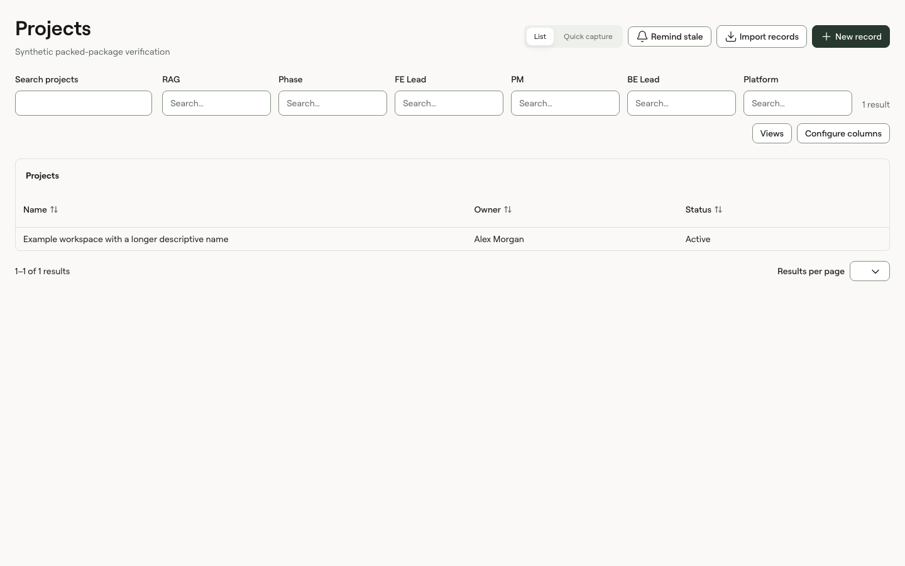
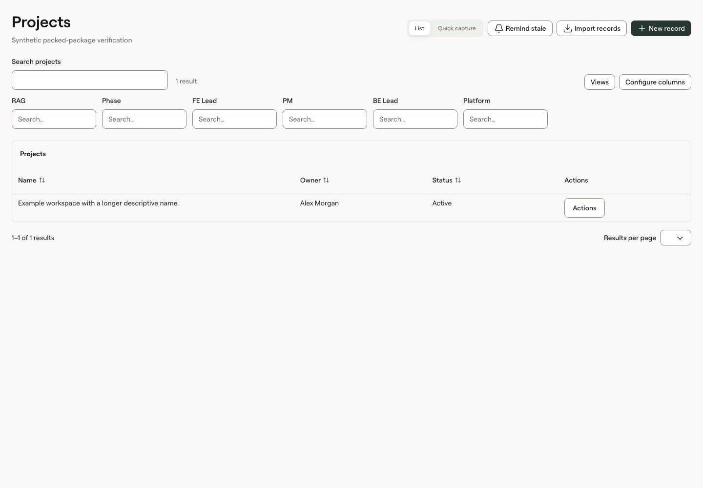

# List-page consistency verification

## Findings and corrections

The 0.11.0 header reproduction measured a wrapped small command at 32px and two direct small button links at 36px. PageHeader's action container stretched direct children to match a segmented control. Centring the container fixes the mismatch while preserving 48px mobile and coarse-pointer targets.

FilterToolbar allowed search to absorb its row without a maximum. Its grouped filters and sibling application actions produced inconsistent layouts. Version 0.11.1 caps desktop search at 320px, groups table actions with search, and moves filters to a separate wrapping row. Narrow search fills its container; labelled fields can share two columns. Plain table headers now centre alongside sortable headers.

The canonical List pages stories cover Projects, Retainers, Clients and a constrained container. They intentionally use synthetic records and illustrative callbacks. The adoption guide and Claude Code prompt define the real application migration, including local Retainer controls, action placement, the non-empty All statuses value, table settings and preserved business behaviour.

## Visual evidence

The baseline below combines the v0.11.0 source styles and original toolbar child order with the same synthetic packed fixture. It demonstrates the 32/36px header mismatch and former toolbar layout, not an authenticated application screenshot. The after image uses the installed 0.11.1 archive. The final fixture adds a plain Actions column to verify mixed table headers.

| Baseline                                                                     | Installed patch                                                           |
| ---------------------------------------------------------------------------- | ------------------------------------------------------------------------- |
|  |  |

[Projects desktop](fixtures/2026-09-15-list-pages/projects-1440.png), [Projects mobile](fixtures/2026-09-15-list-pages/projects-390.png), [Retainers desktop](fixtures/2026-09-15-list-pages/retainers-1440.png) and [Clients desktop](fixtures/2026-09-15-list-pages/clients-1440.png) show the canonical composition. [Packed dark desktop](fixtures/2026-09-15-list-pages/packed-dark-1440.png) and [packed dark mobile](fixtures/2026-09-15-list-pages/packed-dark-390.png) exercise the distributed stylesheet without preview fonts.

## Validation

Passed locally on the patch branch:

- `pnpm check`: 306 tests, types, lint, tokens, build, unchanged public CSS names and static Storybook.
- `pnpm test:dark`: 246 stories. Coverage passed the existing thresholds; no component logic changed after that run.
- API, formatting, catalogue, release metadata and registry drift checks.
- `pnpm package:check`: 324 packaged files, React/Vite with and without optional chart peers, plus the new installed-package browser assertions.
- `pnpm next:check`: Next.js 16.3.4/pnpm.
- `pnpm compatibility:check`: independent Next.js 15.5.25/npm/Tailwind 4 build and runtime, plus Tailwind 3 CSS processing.
- Browser review of all three canonical pages at 1440px and 390px, including no-match search, long names, menu opening, Escape/focus return and final-page pagination.

`package:check` now runs `scripts/check-packed-layout.mjs` against an isolated installed archive. It measures header button geometry, text contrast, desktop search width, narrow wrapping, plain header alignment and document overflow in both themes at 1440px/390px. Its screenshots are written to ignored `artifacts/list-pages`. Interactive behaviour is covered in browser stories; the packed geometry fixture uses server-rendered markup and does not claim hydration or application behaviour coverage.

Early test failures were verification defects: an ambiguous result-count query and an incorrect 32px mobile expectation. Both were corrected. Theme screenshots now select the theme before rendering to avoid capturing an in-progress colour transition. Full checks passed after the production changes. Existing intentional ErrorBoundary errors and React test warnings appear in the logs; they do not represent failed tests.

GitHub CI and tagged publication are recorded on the release PR and workflow. This document does not claim independent human reviewer approval. No cd_capacity files, dependencies, builds, tests, business actions or authenticated sessions were changed or run. Its owner must perform the migration and application checks in the handoff prompt.
